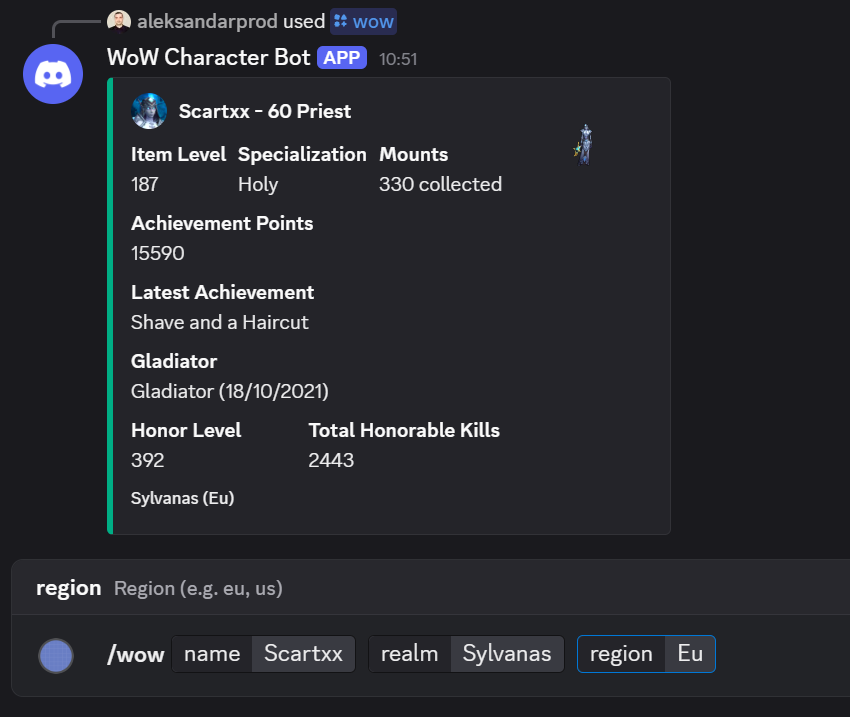

# WoW Discord Bot

A Discord bot built with discord.js that integrates with a custom [WoW API SDK](https://www.npmjs.com/package/wow-api-sdk?activeTab=readme) to fetch and display World of Warcraft character information via slash commands.
Get instant info about your WoW characters right inside Discord — including profile, item level, active specialization, mounts, and achievements.



## Features

- Slash command `/wow` to query character data by name, realm, and region
  - Displays character portrait, item level, active specialization, latest achievement, and mount count in a rich embed
- Slash command `/wow-compare` to compare **two characters** side by side
  - Shows Item Level, Achievement Points, Honor Level, Honorable Kills, Mounts, and **Gladiator achievement (Yes 🟢 / No ❌)**
  - Highlights higher numerical stats with a green indicator for easy comparison
- Built with modular code using a [WoW API SDK](https://www.npmjs.com/package/wow-api-sdk?activeTab=readme) for easy API integration
- Robust error handling with informative user feedback
- Supports multiple WoW regions (eu, us, etc.)

## Installation

Clone the repo and install dependencies:

```bash
git clone https://github.com/AProd18/wow-discord-bot.git
cd wow-discord-bot
npm install
```

## Configuration

Create a .env file in the root directory with your Discord and Blizzard API credentials:

```jsx
DISCORD_TOKEN = your_discord_bot_token;
CLIENT_ID = your_discord_client_id;
BLIZZARD_CLIENT_ID = your_blizzard_client_id;
BLIZZARD_CLIENT_SECRET = your_blizzard_client_secret;
```

## Quick Start

Run the bot locally:

```bash
node deploy-commands.js  # register slash commands globally or per guild
node index.js           # start the bot

```

Use the slash command in Discord:

```bash
/wow name:<character_name> realm:<realm_name> region:<region>
/wow-compare name1:<character1> realm1:<realm1> region1:<region1> name2:<character2> realm2:<realm2> region2:<region2>
```

## Example Output

/wow
The bot replies with an embed including:

- Character name and class with avatar icon (as author)
- Full-body character thumbnail image
- Item level
- Active specialization
- Number of mounts collected
- Latest achievement earned
- Realm and region footer

/wow-compare
The bot replies with a side-by-side comparison embed including:

Stat Player 1 Player 2
Item Level 200 🟢 195
Achievement Points 2500 2600 🟢
Honor Level 45 50 🟢
Honorable Kills 500 480 🟢
Mounts 120 🟢 110
Gladiator Achievement Yes 🟢 No ❌

## How it works

- The bot uses slash commands via Discord API (discord.js v14+)
- Calls the WoW API SDK to fetch character data from Blizzard API
- SDK manages OAuth token retrieval and caching
- Data is formatted into Discord embeds and sent as responses

## Available Slash Command Options

/wow
| Option | Description | Required |
| -------- | ------------------------ | -------- |
| `name` | Character name | Yes |
| `realm` | Character realm | Yes |
| `region` | WoW region (e.g. eu, us) | Yes |

/wow-compare
| Option | Description | Required |
| --------- | -------------------------------- | -------- |
| `name1` | First character name | Yes |
| `realm1` | First character realm | Yes |
| `region1` | First character region (eu, us) | Yes |
| `name2` | Second character name | Yes |
| `realm2` | Second character realm | Yes |
| `region2` | Second character region (eu, us) | Yes |
